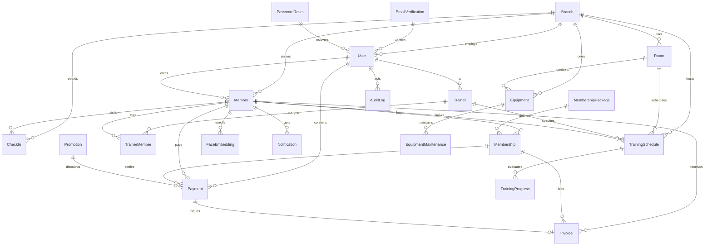
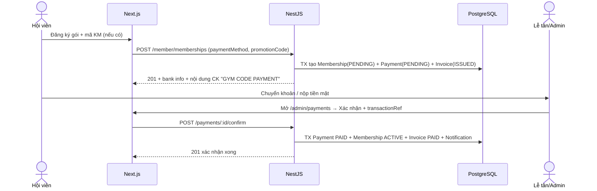
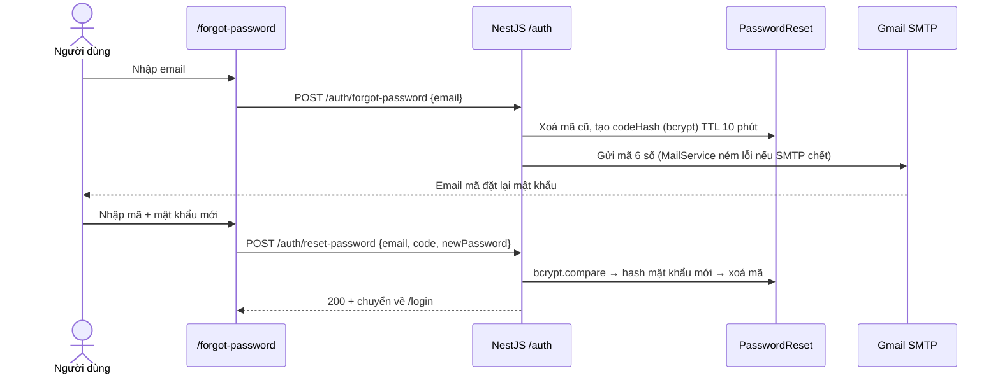

# Phụ lục báo cáo — ERD, Use-case, Sequence và kịch bản demo

> File này sinh cho đồ án GymShark (P0). Dán trực tiếp vào báo cáo tốt nghiệp:
> ERD dạng Mermaid (hỗ trợ trên Notion/GitHub/Markdown), bảng use-case theo 5 vai trò,
> 2 sequence quan trọng nhất và kịch bản demo 10 phút.

## 1. Sơ đồ quan hệ (ERD rút gọn)

Quy ước xóa: `Cascade` cho dữ liệu phụ thuộc sống (Room của Branch,
Trainer của User, Membership của Member); `SetNull` cho lịch sử phải giữ
(AuditLog.userId, Payment.promotionId, Invoice.paymentId); `Restrict` cho
tài chính/vận hành quan trọng (Payment.memberId, Membership.packageId).

## 2. Use-case theo vai trò (5 actor)

| Actor | Use-case chính | Route FE tiêu biểu |
|---|---|---|
| Khách | Xem trang chủ/gói/HLV/lịch/blog/liên hệ, đăng ký 2 bước qua email, đăng nhập, quên mật khẩu | `/`, `/packages`, `/register`, `/forgot-password`, `/login` |
| MEMBER | Dashboard, đăng ký/gia hạn gói + áp mã KM, check-in/out (thủ công + FACE_ID 1:1), lịch tập, HLV của tôi, hóa đơn + in biên lai, hồ sơ, thông báo | `/member`, `/member/register-membership/[packageId]`, `/member/checkin`, `/member/face-registration`, `/member/payments` |
| STAFF (lễ tân) | Check-in hộ (QR/thủ công/FACE_ID 1:N), quản lý hội viên/thẻ/gói/lịch, xác nhận CASH/BANK_TRANSFER, bảo trì thiết bị | `/admin/checkins`, `/admin/members`, `/admin/payments` |
| MANAGER | Mọi vận hành của STAFF + khuyến mãi, chi nhánh/phòng/thiết bị, báo cáo 8 tab + CSV, nhật ký hệ thống | `/admin/promotions`, `/admin/branches`, `/admin/reports`, `/admin/audit-logs` |
| ADMIN | Toàn quyền MANAGER + quản lý tài khoản/đổi vai trò, hoàn tiền MoMo/VNPay, cài đặt | `/admin/settings`, `/admin/members/[id]` |
| TRAINER | Dashboard dạy, lịch dạy, học viên phụ trách, ghi tiến trình, hồ sơ + đổi mật khẩu | `/trainer`, `/trainer/schedule`, `/trainer/members` |

## 3. Sequence thanh toán (PENDING → PAID)

Trùng `transactionRef` → 409. Từ chối → Payment CANCELLED + Invoice CANCELLED.
Hoàn tiền → REFUNDED và không tính vào doanh thu.

## 4. Sequence quên mật khẩu (mới, P0)

Chống dò tài khoản: API trả cùng thông điệp dù email tồn tại hay không.
Sai 5 lần hoặc hết hạn → xoá yêu cầu, buộc gửi mã mới. Audit:
`PASSWORD_RESET_REQUEST` / `PASSWORD_RESET_SUCCESS`.

## 5. Kịch bản demo bảo vệ (10 phút)

1. (1') Trang chủ + `/packages` (banner KM) — nêu design system dark + neon.
2. (1') `/register` 2 bước: nhập form → nhận mã Gmail thật → verify tạo `MEM-xxxx`.
3. (2') Member đăng ký gói + áp mã `SUMMER2026` → hiện breakdown Giá gốc/Giảm/Thành tiền.
4. (2') Admin `/admin/payments`: xác nhận + `transactionRef` → Payment PAID,
   Membership ACTIVE, Invoice PAID. Mở `/member/payments/[id]` in biên lai.
5. (2') `/member/checkin` tab Khuôn mặt (1:1) + `/admin/checkins` dialog quét 1:N.
   Nói rõ consent NĐ13 + ngưỡng 0.6/0.7 + anti-spoof.
6. (1') `/admin/reports` 8 tab + xuất CSV + `/admin/audit-logs` lọc action.
7. (1') Câu hỏi dự phòng: mở Swagger `/api/docs`, thử 403 STAFF vào audit-logs,
   thử trùng `transactionRef` 409, thử `/forgot-password` end-to-end.

## 6. Checklist trước hôm bảo vệ

- [ ] `frontend`: typecheck + lint + format:check PASS, build đủ 53 routes (52 cũ + `/forgot-password`).
- [ ] `backend`: `nest build` + `prisma validate` PASS, `GET /api/health` → `database: connected`.
- [ ] Seed demo sạch: 1 thẻ = 1 payment = 1 invoice, `Invoice.total = Payment.amount`.
- [ ] Gmail SMTP thật + throttle login 10/60s (đăng nhập 1 lần rồi tái dùng session khi demo).
- [ ] Xóa route `camera-test`, không còn `console.error` ở 6 màn hình chính.
